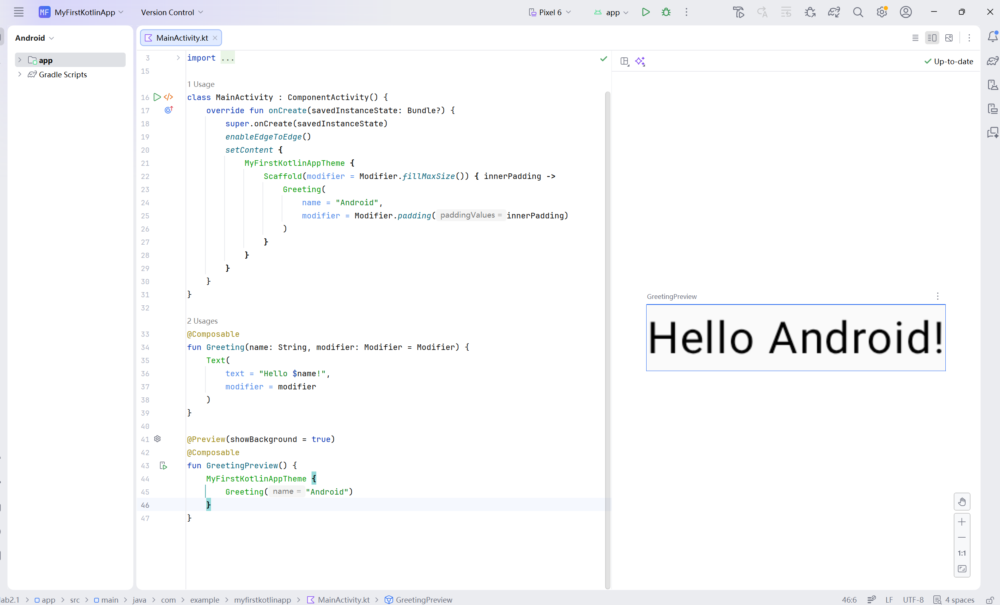
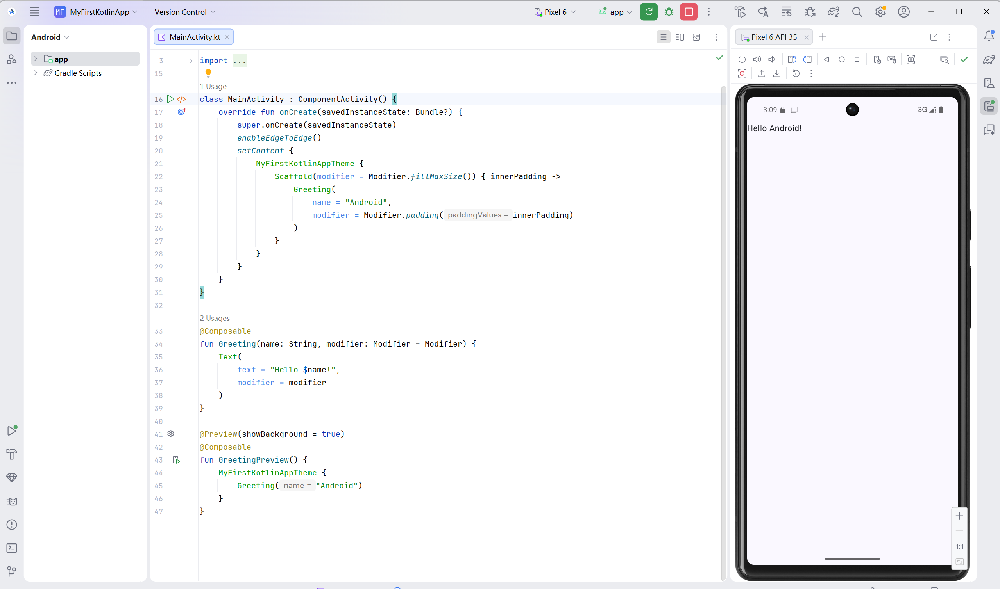
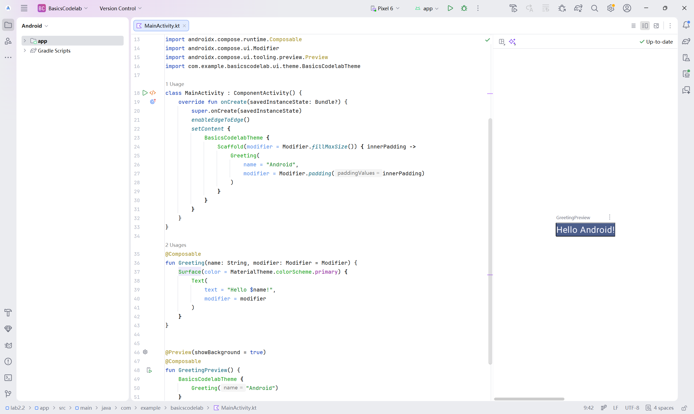
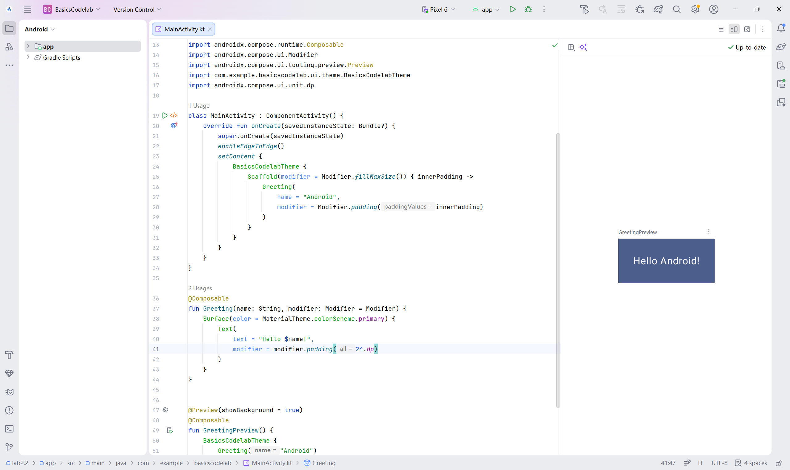
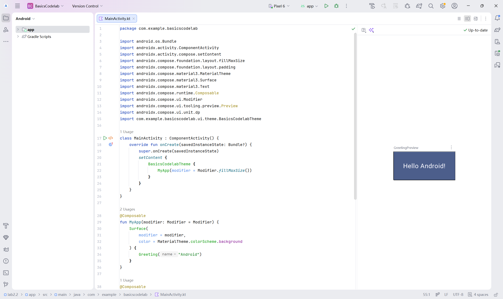
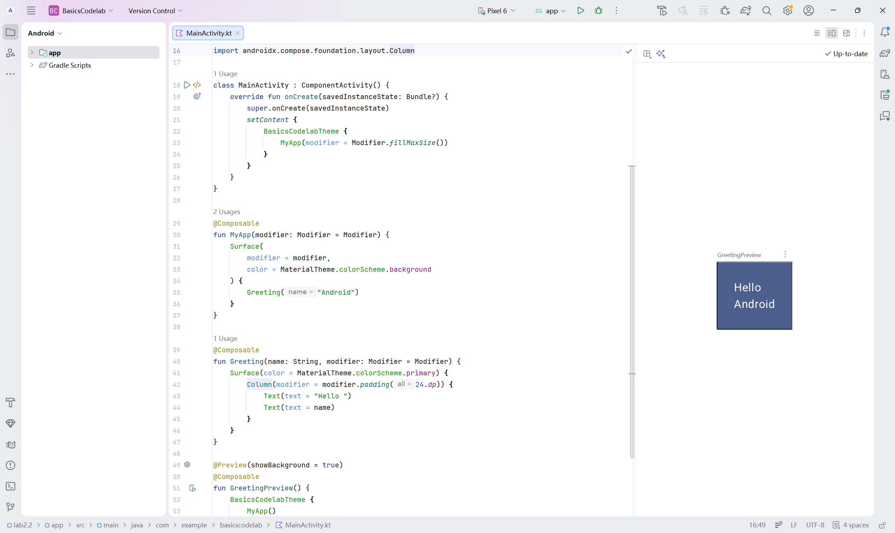
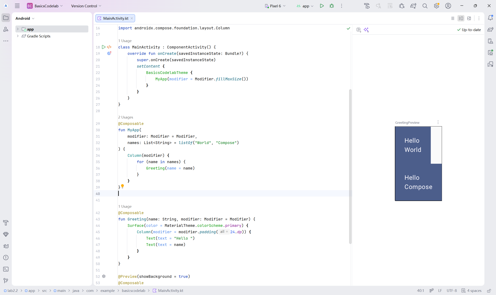
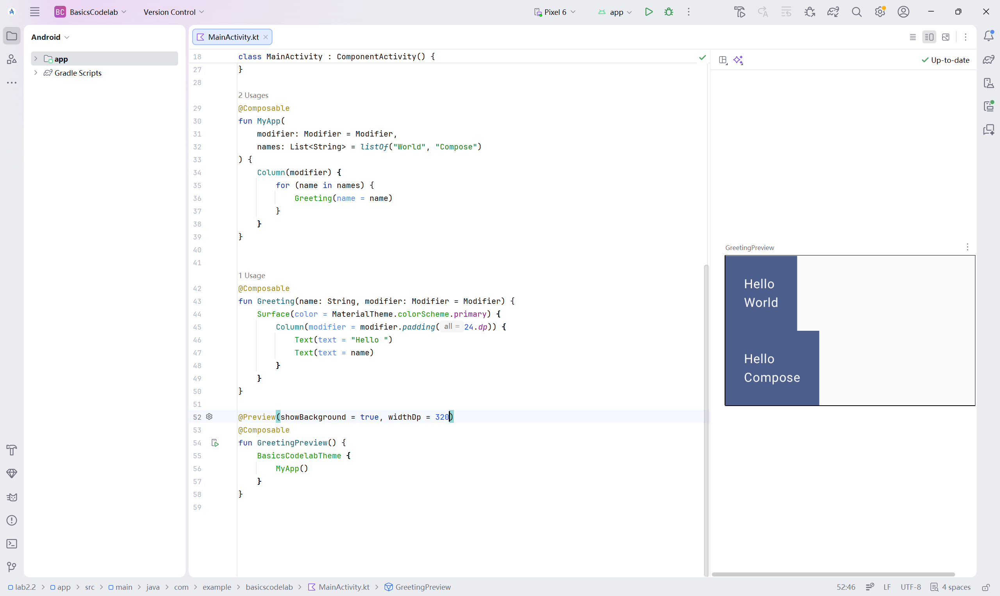
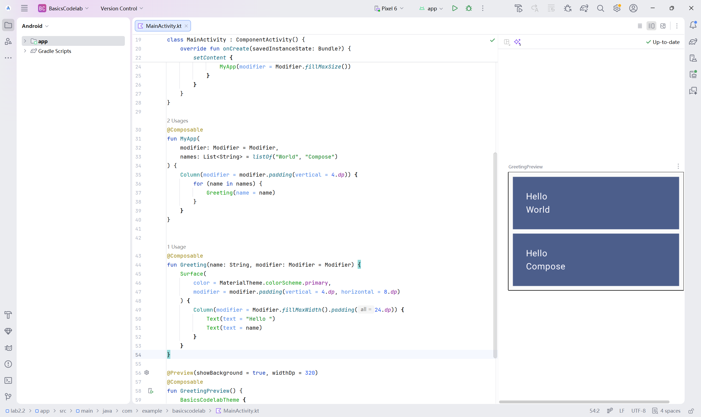
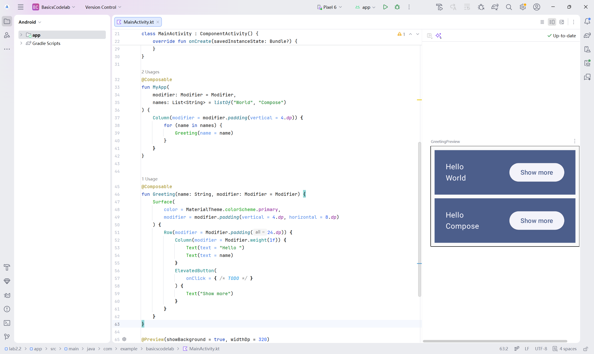

# 构建Kotlin应用并使用Compose布局

## 实验目的

• 掌握使用Kotlin语言开发Android的基本流程

• 掌握Android Compose布局的基本用法

• 进一步熟悉Kotlin语言的特性

## 实验内容

• 学习基于Kotlin语言的Android开发

• 任务一：按照教程完成首个Kotlin APP的构建

• 任务二：按照教程完成Compose布局的实践

• 任务三：完成面向AI应用的Compose布局

• 要求上传代码至Github，并撰写详细的Readme

文档

#### 任务一：创建首个Kotlin应用

选择创建一个Empty Activity，选择Kotlin语言，命名应用程序，并最小支持API Level 21（Compose支持的最低版本）

Compose Preview：



Run：



#### 任务二：实践Compose布局

界面：



修饰符：



重复使用可组合项：



创建Compose中的列(Column) 和行(Row)：



Compose和Kotlin：

1、循环向Column中添加元素



2、更改预览效果，模拟手机宽度320dp



3、为修饰符添加更多属性



#### 添加按钮：



Compose中的状态(State)：

预览：

<video src="videos\preview.mp4"></video>

模拟器：

<video src="videos\simulation.mp4"></video>

#### 任务三：完成面向AI应用的Compose布局

MainActivity.kt：

```kotlin
package com.example.lab2_3

import android.os.Bundle
import androidx.activity.ComponentActivity
import androidx.activity.compose.setContent
import androidx.compose.foundation.BorderStroke
import androidx.compose.foundation.background
import androidx.compose.foundation.layout.Arrangement
import androidx.compose.foundation.layout.Box
import androidx.compose.foundation.layout.Column
import androidx.compose.foundation.layout.Row
import androidx.compose.foundation.layout.Spacer
import androidx.compose.foundation.layout.fillMaxSize
import androidx.compose.foundation.layout.fillMaxWidth
import androidx.compose.foundation.layout.height
import androidx.compose.foundation.layout.navigationBarsPadding
import androidx.compose.foundation.layout.padding
import androidx.compose.foundation.layout.size
import androidx.compose.foundation.layout.statusBarsPadding
import androidx.compose.foundation.rememberScrollState
import androidx.compose.foundation.shape.CircleShape
import androidx.compose.foundation.shape.RoundedCornerShape
import androidx.compose.foundation.verticalScroll
import androidx.compose.material3.Button
import androidx.compose.material3.ButtonDefaults
import androidx.compose.material3.Card
import androidx.compose.material3.CardDefaults
import androidx.compose.material3.ElevatedCard
import androidx.compose.material3.LinearProgressIndicator
import androidx.compose.material3.MaterialTheme
import androidx.compose.material3.OutlinedButton
import androidx.compose.material3.Scaffold
import androidx.compose.material3.Surface
import androidx.compose.material3.Text
import androidx.compose.material3.Typography
import androidx.compose.material3.lightColorScheme
import androidx.compose.runtime.Composable
import androidx.compose.runtime.getValue
import androidx.compose.runtime.mutableStateOf
import androidx.compose.runtime.remember
import androidx.compose.runtime.setValue
import androidx.compose.ui.Alignment
import androidx.compose.ui.Modifier
import androidx.compose.ui.draw.clip
import androidx.compose.ui.graphics.Brush
import androidx.compose.ui.graphics.Color
import androidx.compose.ui.text.font.FontWeight
import androidx.compose.ui.tooling.preview.Preview
import androidx.compose.ui.unit.dp
import androidx.compose.ui.unit.sp

class MainActivity : ComponentActivity() {
    override fun onCreate(savedInstanceState: Bundle?) {
        super.onCreate(savedInstanceState)
        setContent {
            AiVisionTheme {
                Surface(modifier = Modifier.fillMaxSize()) {
                    AiVisionScreen()
                }
            }
        }
    }
}

private val AppColorScheme = lightColorScheme(
    primary = Color(0xFF2563EB),
    onPrimary = Color.White,
    secondary = Color(0xFF10B981),
    onSecondary = Color.White,
    background = Color(0xFFF6F8FC),
    surface = Color.White,
    onSurface = Color(0xFF0F172A),
    surfaceVariant = Color(0xFFEAF0F8)
)

@Composable
fun AiVisionTheme(content: @Composable () -> Unit) {
    MaterialTheme(
        colorScheme = AppColorScheme,
        typography = Typography(),
        content = content
    )
}

@Composable
fun AiVisionScreen(modifier: Modifier = Modifier) {
    val modes = listOf("快速", "均衡", "精准")
    val results = listOf("绿植健康", "疑似宠物", "普通物体")

    var selectedMode by remember { mutableStateOf(modes[1]) }
    var hasImage by remember { mutableStateOf(false) }
    var hasResult by remember { mutableStateOf(false) }
    var resultIndex by remember { mutableStateOf(0) }

    val resultText = if (hasResult) results[resultIndex] else "尚未识别"
    val resultTip = if (hasResult) "AI 已完成图像判断" else "点击开始识别后显示结果"
    val confidence = if (hasResult) "96.2%" else "--"
    val time = if (hasResult) {
        when (selectedMode) {
            "快速" -> "18 ms"
            "均衡" -> "28 ms"
            else -> "42 ms"
        }
    } else {
        "--"
    }
    val progress = if (hasResult) 0.962f else 0f

    Scaffold(
        containerColor = Color.Transparent,
        bottomBar = {
            BottomActionBar(
                onAnalyze = {
                    hasImage = true
                    hasResult = true
                    resultIndex = (resultIndex + 1) % results.size
                },
                onClear = {
                    hasImage = false
                    hasResult = false
                }
            )
        }
    ) { innerPadding ->
        Box(
            modifier = modifier
                .fillMaxSize()
                .background(
                    Brush.verticalGradient(
                        colors = listOf(
                            Color(0xFFEAF2FF),
                            Color(0xFFF8FAFC),
                            Color.White
                        )
                    )
                )
                .padding(innerPadding)
        ) {
            Column(
                modifier = Modifier
                    .fillMaxSize()
                    .statusBarsPadding()
                    .verticalScroll(rememberScrollState())
                    .padding(horizontal = 18.dp, vertical = 8.dp),
                verticalArrangement = Arrangement.spacedBy(12.dp)
            ) {
                HeaderSection()

                PreviewCard(
                    hasImage = hasImage,
                    hasResult = hasResult
                )

                ModeSegmentedRow(
                    modes = modes,
                    selectedMode = selectedMode,
                    onModeSelected = {
                        selectedMode = it
                        hasResult = false
                    }
                )

                ResultCard(
                    resultText = resultText,
                    resultTip = resultTip,
                    confidence = confidence,
                    time = time,
                    progress = progress,
                    hasResult = hasResult
                )

                Spacer(modifier = Modifier.height(6.dp))
            }
        }
    }
}

@Composable
fun HeaderSection() {
    Box(
        modifier = Modifier
            .fillMaxWidth()
            .padding(top = 0.dp, bottom = 30.dp),
        contentAlignment = Alignment.Center
    ) {
        Text(
            text = "AI Visio",
            fontSize = 34.sp,
            fontWeight = FontWeight.Bold,
            color = Color(0xFF0F172A)
        )
    }
}

@Composable
fun ModeSegmentedRow(
    modes: List<String>,
    selectedMode: String,
    onModeSelected: (String) -> Unit
) {
    Row(
        modifier = Modifier
            .fillMaxWidth()
            .padding(top = 24.dp, bottom = 10.dp),
        horizontalArrangement = Arrangement.spacedBy(10.dp)
    ) {
        modes.forEach { mode ->
            ModeButton(
                text = mode,
                selected = mode == selectedMode,
                onClick = { onModeSelected(mode) },
                modifier = Modifier.weight(1f)
            )
        }
    }
}

@Composable
fun ModeButton(
    text: String,
    selected: Boolean,
    onClick: () -> Unit,
    modifier: Modifier = Modifier
) {
    if (selected) {
        Button(
            onClick = onClick,
            modifier = modifier.height(44.dp),
            shape = RoundedCornerShape(16.dp),
            colors = ButtonDefaults.buttonColors(
                containerColor = Color(0xFF2563EB),
                contentColor = Color.White
            )
        ) {
            Text(
                text = text,
                fontSize = 15.sp,
                fontWeight = FontWeight.Bold
            )
        }
    } else {
        OutlinedButton(
            onClick = onClick,
            modifier = modifier.height(44.dp),
            shape = RoundedCornerShape(16.dp),
            border = BorderStroke(1.dp, Color(0xFFCBD5E1)),
            colors = ButtonDefaults.outlinedButtonColors(
                contentColor = Color(0xFF334155)
            )
        ) {
            Text(
                text = text,
                fontSize = 15.sp,
                fontWeight = FontWeight.SemiBold
            )
        }
    }
}

@Composable
fun PreviewCard(
    hasImage: Boolean,
    hasResult: Boolean
) {
    Card(
        modifier = Modifier.fillMaxWidth(),
        shape = RoundedCornerShape(28.dp),
        colors = CardDefaults.cardColors(containerColor = Color.White),
        border = BorderStroke(1.dp, Color(0xFFDCE5F2))
    ) {
        Box(
            modifier = Modifier
                .fillMaxWidth()
                .padding(16.dp)
                .height(210.dp)
                .clip(RoundedCornerShape(24.dp))
                .background(
                    Brush.linearGradient(
                        colors = if (hasImage) {
                            listOf(Color(0xFFDFF6FF), Color(0xFFE9FDF3))
                        } else {
                            listOf(Color(0xFFE8EEF6), Color(0xFFF7F9FC))
                        }
                    )
                ),
            contentAlignment = Alignment.Center
        ) {
            Column(horizontalAlignment = Alignment.CenterHorizontally) {
                AiPreviewMark(hasImage = hasImage)

                Spacer(modifier = Modifier.height(12.dp))

                Text(
                    text = when {
                        hasResult -> "识别完成"
                        hasImage -> "图片已载入"
                        else -> "添加图片"
                    },
                    fontSize = 22.sp,
                    fontWeight = FontWeight.Bold,
                    color = Color(0xFF1E293B)
                )

                Spacer(modifier = Modifier.height(4.dp))

                Text(
                    text = if (hasImage) "点击识别获取结果" else "拍照或从相册导入",
                    fontSize = 14.sp,
                    color = Color(0xFF64748B)
                )
            }
        }
    }
}

@Composable
fun AiPreviewMark(hasImage: Boolean) {
    Box(
        modifier = Modifier
            .size(64.dp)
            .clip(RoundedCornerShape(22.dp))
            .background(if (hasImage) Color(0xFFD1FAE5) else Color(0xFFE2E8F0)),
        contentAlignment = Alignment.Center
    ) {
        Box(
            modifier = Modifier
                .size(44.dp)
                .clip(CircleShape)
                .background(if (hasImage) Color(0xFF10B981) else Color(0xFF94A3B8)),
            contentAlignment = Alignment.Center
        ) {
            Text(
                text = "AI",
                fontSize = 16.sp,
                fontWeight = FontWeight.Bold,
                color = Color.White
            )
        }
    }
}

@Composable
fun ResultCard(
    resultText: String,
    resultTip: String,
    confidence: String,
    time: String,
    progress: Float,
    hasResult: Boolean
) {
    ElevatedCard(
        modifier = Modifier.fillMaxWidth(),
        shape = RoundedCornerShape(28.dp),
        colors = CardDefaults.elevatedCardColors(containerColor = Color.White),
        elevation = CardDefaults.elevatedCardElevation(defaultElevation = 4.dp)
    ) {
        Column(
            modifier = Modifier.padding(16.dp),
            verticalArrangement = Arrangement.spacedBy(12.dp)
        ) {
            LinearProgressIndicator(
                progress = progress,
                modifier = Modifier
                    .fillMaxWidth()
                    .height(7.dp)
                    .clip(CircleShape),
                color = Color(0xFF2563EB),
                trackColor = Color(0xFFE2E8F0)
            )

            ResultInsightBox(
                resultText = resultText,
                resultTip = resultTip,
                hasResult = hasResult
            )

            Row(horizontalArrangement = Arrangement.spacedBy(10.dp)) {
                MetricBox(
                    title = "Confidence",
                    value = confidence,
                    modifier = Modifier.weight(1f)
                )

                MetricBox(
                    title = "Time",
                    value = time,
                    modifier = Modifier.weight(1f)
                )
            }
        }
    }
}

@Composable
fun ResultInsightBox(
    resultText: String,
    resultTip: String,
    hasResult: Boolean
) {
    Card(
        modifier = Modifier.fillMaxWidth(),
        shape = RoundedCornerShape(24.dp),
        colors = CardDefaults.cardColors(
            containerColor = if (hasResult) Color(0xFFEFF6FF) else Color(0xFFF7F9FC)
        ),
        border = BorderStroke(
            width = 1.dp,
            color = if (hasResult) Color(0xFFBFDBFE) else Color(0xFFE2E8F0)
        )
    ) {
        Row(
            modifier = Modifier.padding(horizontal = 16.dp, vertical = 15.dp),
            verticalAlignment = Alignment.CenterVertically
        ) {
            Box(
                modifier = Modifier
                    .size(46.dp)
                    .clip(CircleShape)
                    .background(if (hasResult) Color(0xFF2563EB) else Color(0xFFE2E8F0)),
                contentAlignment = Alignment.Center
            ) {
                Text(
                    text = "AI",
                    fontSize = 14.sp,
                    fontWeight = FontWeight.Bold,
                    color = if (hasResult) Color.White else Color(0xFF64748B)
                )
            }

            Column(
                modifier = Modifier
                    .weight(1f)
                    .padding(start = 14.dp)
            ) {
                Text(
                    text = resultText,
                    fontSize = 23.sp,
                    fontWeight = FontWeight.Bold,
                    color = if (hasResult) Color(0xFF0F172A) else Color(0xFF64748B)
                )

                Spacer(modifier = Modifier.height(3.dp))

                Text(
                    text = resultTip,
                    fontSize = 13.sp,
                    color = Color(0xFF64748B)
                )
            }
        }
    }
}

@Composable
fun MetricBox(
    title: String,
    value: String,
    modifier: Modifier = Modifier
) {
    Card(
        modifier = modifier,
        shape = RoundedCornerShape(20.dp),
        colors = CardDefaults.cardColors(containerColor = Color(0xFFF7F9FC))
    ) {
        Column(
            modifier = Modifier.padding(horizontal = 15.dp, vertical = 11.dp)
        ) {
            Text(
                text = title,
                fontSize = 13.sp,
                color = Color(0xFF64748B),
                fontWeight = FontWeight.Medium
            )

            Spacer(modifier = Modifier.height(4.dp))

            Text(
                text = value,
                fontSize = 19.sp,
                color = Color(0xFF0F172A),
                fontWeight = FontWeight.Bold
            )
        }
    }
}

@Composable
fun BottomActionBar(
    onAnalyze: () -> Unit,
    onClear: () -> Unit
) {
    Surface(
        modifier = Modifier.fillMaxWidth(),
        color = Color.Transparent
    ) {
        ElevatedCard(
            modifier = Modifier
                .fillMaxWidth()
                .navigationBarsPadding()
                .padding(horizontal = 18.dp, vertical = 10.dp),
            shape = RoundedCornerShape(26.dp),
            colors = CardDefaults.elevatedCardColors(containerColor = Color.White),
            elevation = CardDefaults.elevatedCardElevation(defaultElevation = 8.dp)
        ) {
            Row(
                modifier = Modifier.padding(12.dp),
                horizontalArrangement = Arrangement.spacedBy(12.dp),
                verticalAlignment = Alignment.CenterVertically
            ) {
                OutlinedButton(
                    onClick = onClear,
                    modifier = Modifier
                        .weight(0.9f)
                        .height(52.dp),
                    shape = RoundedCornerShape(18.dp),
                    border = BorderStroke(1.dp, Color(0xFFFCA5A5)),
                    colors = ButtonDefaults.outlinedButtonColors(
                        containerColor = Color(0xFFFFF7F7),
                        contentColor = Color(0xFFDC2626)
                    )
                ) {
                    Text(
                        text = "清空",
                        fontSize = 15.sp,
                        fontWeight = FontWeight.Bold
                    )
                }

                Button(
                    onClick = onAnalyze,
                    modifier = Modifier
                        .weight(1.45f)
                        .height(52.dp),
                    shape = RoundedCornerShape(18.dp),
                    colors = ButtonDefaults.buttonColors(
                        containerColor = Color(0xFF2563EB),
                        contentColor = Color.White
                    )
                ) {
                    Text(
                        text = "开始识别",
                        fontSize = 17.sp,
                        fontWeight = FontWeight.Bold
                    )
                }
            }
        }
    }
}

@Preview(showBackground = true, showSystemUi = true)
@Composable
fun AiVisionScreenPreview() {
    AiVisionTheme {
        AiVisionScreen()
    }
}
```

模拟器界面：


