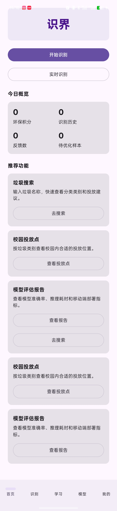
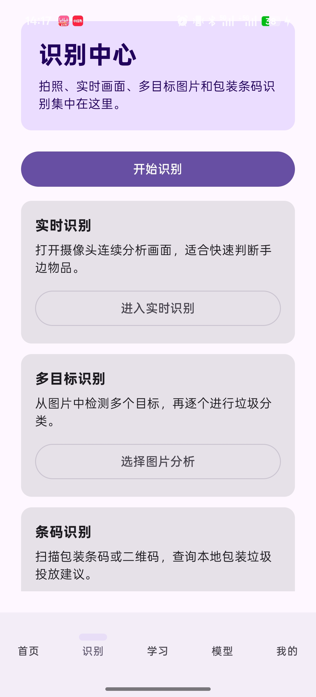
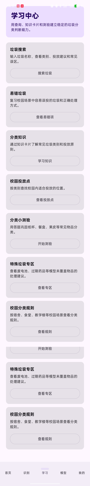
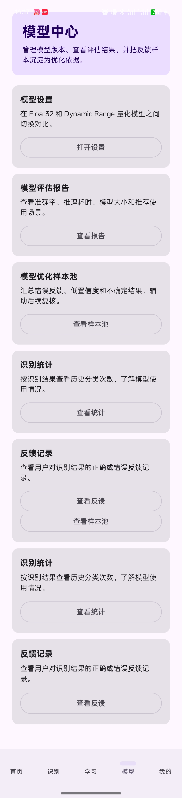
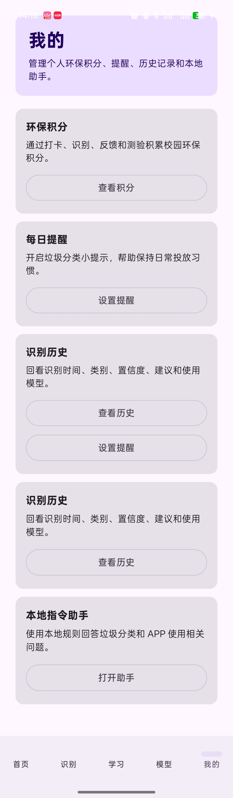

# 期末大作业——“识界”，一款基于Android + LiteRT的垃圾分类APP

#### 一、识别类型

| 类别编号 | 英文标签       | 中文名称   | 分类建议 |
| -------- | -------------- | ---------- | -------- |
| 0        | can            | 易拉罐     | 可回收物 |
| 1        | food_box       | 餐盒       | 可回收物 |
| 2        | food_packaging | 食品外包装 | 可回收物 |
| 3        | fruit_peel     | 果皮       | 其他垃圾 |
| 4        | paper          | 纸张       | 其他垃圾 |
| 5        | paper_cup      | 纸杯       | 厨余垃圾 |
| 6        | plastic_bottle | 塑料瓶     | 其他垃圾 |

#### 二、训练识别模型的数据集来源

TACO数据集仓库

TrashNet数据集

Kaggle Garbage Classification 12 classes

Roboflow Universe

HGI -30数据集

每一类经过人工挑选各600张统一格式的图片

数据集划分：

| 类别           | 总数 | train | val  | test |
| -------------- | ---- | ----- | ---- | ---- |
| plastic_bottle | 600  | 480   | 60   | 60   |
| paper          | 600  | 480   | 60   | 60   |
| can            | 600  | 480   | 60   | 60   |
| paper_cup      | 600  | 480   | 60   | 60   |
| food_box       | 600  | 480   | 60   | 60   |
| fruit_peel     | 600  | 480   | 60   | 60   |
| food_packaging | 500  | 400   | 50   | 50   |

#### 三、识别模型的训练方案

MobileNetV2 迁移学习

微调 fine-tuning

可选动态范围量化 dynamic range quantization

#### 四、识别模型

1、waste_classification_mobilenetv2_v1_dynamic_range.tflite 是 Float32 全精度模型，保留了原始模型的浮点权重。在本项目测试集中，该模型共测试 410 张图片，正确识别 386 张，测试准确率为 94.15%，平均推理耗时约为 5.98 ms。由于在当前测试环境下推理速度较快、识别结果稳定，因此 APP 默认优先使用该模型。

2、waste_classification_mobilenetv2_v1_float32.tflite 是经过 Dynamic Range 训练后量化得到的模型。该模型主要用于展示移动端模型压缩与量化部署思路。测试结果显示，该模型在同一测试集上的准确率同样为 94.15%，即 410 张测试图片中正确识别 386 张，平均推理耗时约为 26.01 ms。相比 Float32 模型，Dynamic Range 模型文件通常更小，适合用于移动端部署

#### 五、项目结构

EX_Final-Waste-Classification-App/
├── android_app/                         # Android 垃圾分类 APP 工程
│   └── app/src/main/
│       ├── assets/                      # TFLite 模型与 labels.txt
│       ├── java/com/example/wasteclassificationapp/
│       │   ├── data/                    # Room、DataStore、提醒任务等数据层代码
│       │   ├── ml/                      # TFLite 推理、Top-3 候选、图像质量检测
│       │   ├── model/                   # 垃圾知识库、搜索项、投放点、测验题等数据模型
│       │   ├── ui/                      # Compose 页面、Hub 页面、底部导航与通用组件
│       │   └── MainActivity.kt          # APP 主入口与页面导航控制
│       ├── res/                         # Android 资源文件
│       └── AndroidManifest.xml          # 权限与应用配置
├── datasets/                            # 数据集
├── models/                              # 模型文件
└── scripts/                             # 训练、测试、模型转换脚本

#### 六、APP演示

一、首页

  

二、识别

  

三、学习中心

  

四、模型中心

  

五、我的

  
